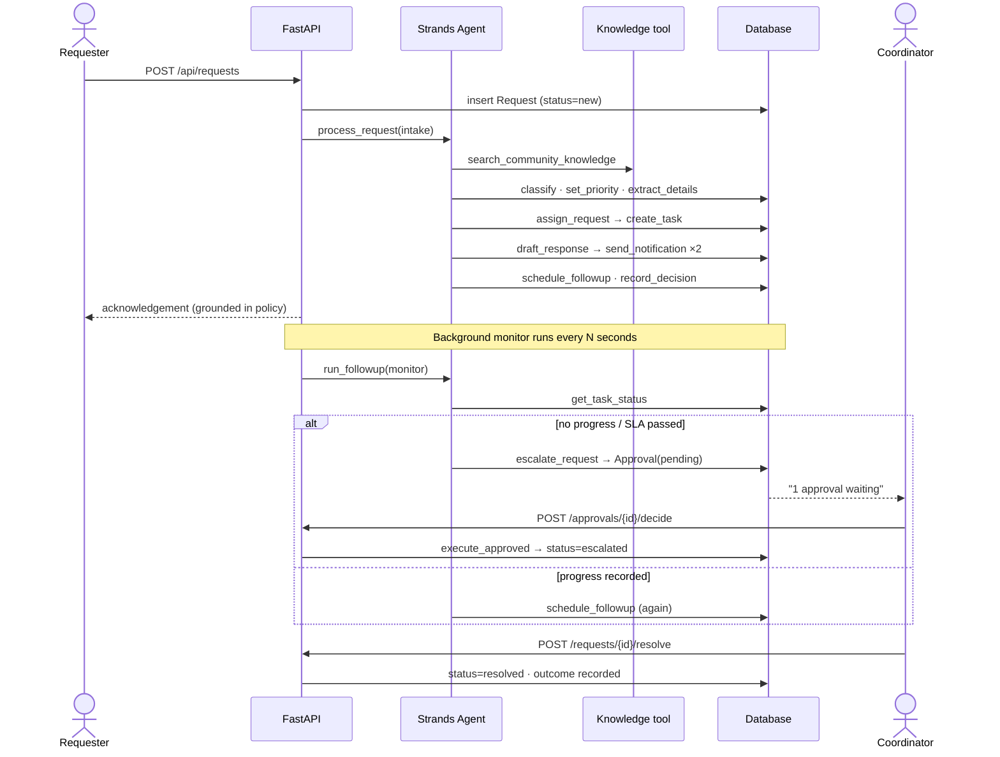

# CivicFlow AI — Architecture

## System overview

```mermaid
flowchart LR
    subgraph Channels["Intake channels"]
        WF[Web form]
        EM[Email / WhatsApp / phone<br/>(entered by staff)]
        DM[Demo scenarios]
    end

    subgraph UI["React dashboard (Vite + TS)"]
        D[Dashboard]
        R[Requests & detail<br/>timeline · reasoning]
        A[Approval queue]
        K[Knowledge base]
        AN[Analytics & reports]
        S[Settings]
    end

    subgraph API["FastAPI backend"]
        RT[/REST /api/*/]
        MON[Background monitor<br/>follow-ups · overdue detection]
    end

    subgraph Agent["CivicFlow Orchestrator (Strands Agents SDK)"]
        ORCH[Agent loop]
        MODEL{{Model}}
        BR[Amazon Bedrock<br/>Claude 3.5 Haiku]
        LP[LocalPolicyModel<br/>deterministic offline]
        subgraph Tools["@tool functions"]
            T1[classify_request]
            T2[set_priority]
            T3[extract_details]
            T4[search_community_knowledge]
            T5[assign_request]
            T6[create_task / update_task]
            T7[draft_response]
            T8[send_notification]
            T9[schedule_followup]
            T10[escalate_request]
            T11[resolve_request]
            T12[record_decision]
            T13[generate_report]
        end
    end

    subgraph Data["SQLAlchemy (SQLite dev · PostgreSQL prod)"]
        DB[(requests · tasks · approvals<br/>agent_events · notifications<br/>followups · knowledge · teams · settings)]
    end

    Channels --> RT
    UI <--> RT
    RT --> ORCH
    MON --> ORCH
    ORCH <--> MODEL
    MODEL -. credentials present .-> BR
    MODEL -. fallback .-> LP
    ORCH --> Tools
    Tools --> DB
    RT --> DB
    T8 -. integration boundary .-> EXT[Email / SMS / WhatsApp<br/>providers]
```

## Request lifecycle



## Human-in-the-loop policy

| Risk tier | Actions | Default behaviour |
|-----------|---------|-------------------|
| low | classify, prioritise, extract, search knowledge, assign, create/update task, draft reply, schedule follow-up, record decision, metrics, report | executed autonomously |
| medium | `send_notification` | executed autonomously (can be gated in Settings) |
| high | `escalate_request`, `resolve_request` | **always** converted into an approval the agent waits for |

The threshold is stored in `settings.autonomy.approval_threshold` and can be lowered to
`medium` or `low` so every outgoing message — or every action — requires a human decision.

## Why one orchestrator with many tools (not many agents)

Each capability in the brief (Request Analyzer, Priority & Risk Analyzer, Task Planner, Assignment,
Notification, Follow-up Scheduler, Escalation, Knowledge/RAG, Reporting, Audit) is a **Strands `@tool`**
the orchestrator calls. This keeps a single, inspectable reasoning loop, a single audit log, and a
single approval gate, while every tool performs a real, persisted side-effect. Splitting these into
separate LLM agents would add latency and cost without adding capability.

## Model strategy

`MODEL_PROVIDER=auto` (default) tries Amazon Bedrock first. If no AWS credentials are available the
same Strands agent runs with `LocalPolicyModel`, an implementation of the Strands `Model` interface
that emits deterministic tool calls (knowledge search → classify → prioritise → …). This means:

* the demo is reproducible without cloud credentials,
* integration tests exercise the exact same tool chain, and
* switching to Bedrock changes *how the agent decides*, not *what it can do*.
